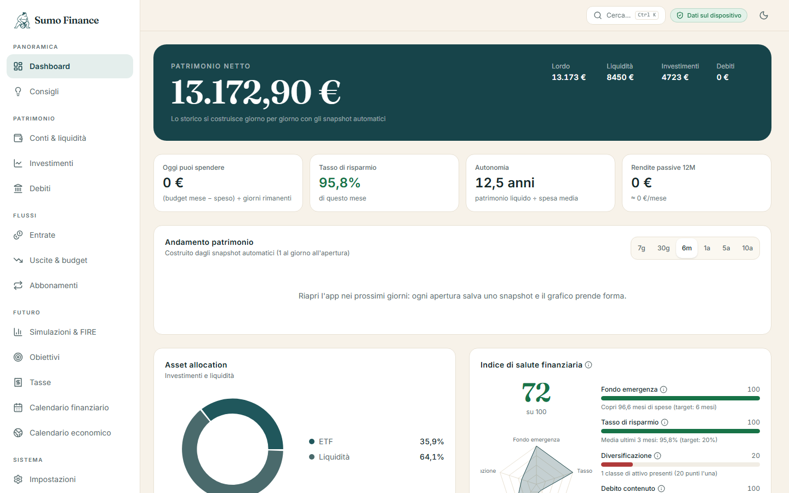
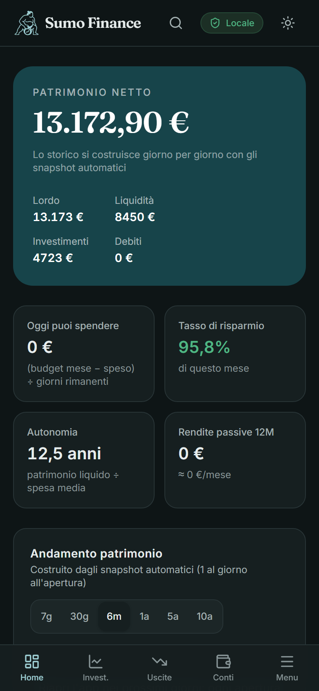

# Sumo Finance — il tuo OS finanziario personale

Web app **local-first** di gestione finanziaria personale: patrimonio, budget, investimenti con
prezzi live, debiti, obiettivi, simulazioni Monte Carlo/FIRE, tasse italiane semplificate,
calendario finanziario ed economico. Interfaccia in italiano, valuta EUR, formato it-IT.
Solida e ben piantata come un sumo: il lottatore del logo è la mascotte dell'app.

> Nato come "PFOS — Personal Financial OS": il nome interno `pfos` sopravvive in database,
> chiavi locali e cache per compatibilità con i dati e i backup esistenti.

**Demo in produzione:** https://sumo-finance.vercel.app





## Cosa fa

- **Dashboard** con patrimonio netto, indice di salute finanziaria 0–100, cash flow,
  asset allocation, report mensile automatico e consigli a regole
- **Investimenti**: ricerca asset unificata (Yahoo + CoinGecko, anche per ISIN), prezzi live,
  operazioni di acquisto/vendita/dividendo/split con PMC e fisco derivati, XIRR, benchmark
  "e se fosse tutto su VWCE?", wallet crypto tracciati on-chain dalla chiave pubblica
  (BTC anche via xpub/ypub/zpub, ETH/ERC-20, SOL)
- **Budget dinamici** (media 3 mesi + override, rollover opzionale), ricorrenti automatici,
  abbonamenti con costo-opportunità, import CSV con regole, deduplica e annulla-import
- **Tasse italiane semplificate**: plusvalenze per anno (crypto 26% fino al 2025, 33% dal
  2026), zainetto fiscale, tasse latenti, CSV e report stampabile per il commercialista
- **Simulazioni Monte Carlo** con scenari what-if, obiettivo FIRE, previsione liquidità 12 mesi
- **Obiettivi** anche agganciati al saldo reale di un conto, debiti con ammortamento francese
- **PWA installabile** ottimizzata per iPhone (bottom bar, splash screen, offline), tema
  chiaro/scuro, backup JSON anche cifrato (AES-256) e backup automatico su cartella

## Avvio

```bash
npm install
npm run dev      # sviluppo su http://localhost:3000
npm run build    # build di produzione
npm start        # serve la build
npm test         # unit test dei motori di calcolo (vitest)
```

Al primo avvio parte l'onboarding (saltabile): in 5 minuti la dashboard è viva.

## Privacy e architettura

- **Tutti i dati vivono nel browser** (IndexedDB via Dexie). Nessun backend, nessun account,
  nessun database remoto.
- Le uniche due API route Next (`/api/quote`, `/api/economic-calendar`) sono **proxy stateless
  di sola lettura** verso dati pubblici di mercato: non ricevono, non registrano e non
  inoltrano alcun dato personale — transitano solo ticker e richieste generiche. Servono
  perché Yahoo Finance e il feed del calendario non consentono CORS.
- Il PIN opzionale è protezione da occhi indiscreti (hash SHA-256 con salt), **non**
  crittografia dei dati.
- Il backup JSON esportabile/importabile è anche il modo per spostare i dati tra dispositivi.
- Su Chrome/Edge desktop puoi attivare il **backup automatico su cartella** (Impostazioni →
  Backup): un file datato al giorno, ultimi 14 conservati — ideale su una cartella
  sincronizzata con Drive/OneDrive.
- Dalla pagina Tasse: **CSV delle operazioni** e **report stampabile/PDF** per il
  commercialista (realizzato, zainetto, imposta stimata, bollo 0,20%).

## Struttura

```
app/                    pagine (tutte client components: i dati sono solo nel browser)
  api/quote/            proxy Yahoo Finance (cache 15 min; 24 h per lo storico 1 anno)
  api/economic-calendar/ proxy feed Forex Factory (cache 4 h)
components/             UI condivisa (shell, grafici, modali, toast con Annulla)
lib/
  types.ts              modello dati completo
  db.ts                 schema Dexie (dettaglio interno di DexieAdapter)
  storage/              StorageAdapter (interfaccia) + DexieAdapter + hook useTable
  engine/               MOTORI DI CALCOLO PURI E TESTATI:
    aggregates.ts         patrimonio, KPI, allocazioni
    health.ts             indice di salute finanziaria 0–100
    budget.ts             budget dinamici (media 3 mesi + override)
    montecarlo.ts         simulazioni, FIRE, probabilità obiettivi
    tax.ts                tasse latenti, zainetto fiscale
    transactions.ts       acquisti/vendite: PMC, realizzato e zainetto derivati
    amortization.ts       piano francese: split rata, estinzione stimata
    xirr.ts               rendimento annualizzato money-weighted (per asset e portafoglio)
    forecast.ts           previsione liquidità a 12 mesi dai flussi strutturati
    benchmark.ts          replay dei flussi su VWCE ("e se fosse tutto sull'indice?")
    advisor.ts            AdvisorProvider + RulesAdvisor (8 regole)
    recurring.ts          registrazione idempotente dei ricorrenti (+ ammortamento)
    calendar.ts           voci auto del calendario (90 giorni)
    state.ts              stato derivato centralizzato
  prices/               PriceProvider + CoinGecko/Yahoo/TwelveData/Frankfurter + sync
  csv.ts                parsing CSV, regole, fingerprint per deduplica
  boot.ts               attività di apertura (ricorrenti, snapshot 1/giorno)
esempi/                 estratto conto CSV di prova per l'import
```

## Modello dati

L'utente inserisce solo dati grezzi: conti, asset, operazioni di acquisto/vendita, debiti,
movimenti, abbonamenti, ricorrenti, obiettivi, scadenze. **Tutto il resto è derivato** in
modo deterministico dai motori in `lib/engine/` (stessa base dati → stessi numeri ovunque).
A ogni apertura l'app:

1. registra i movimenti ricorrenti maturati (idempotente: mai duplicati, via `sourceRef`);
2. per i debiti con **ammortamento automatico**, scala il residuo della quota capitale di
   ogni rata registrata (piano francese);
3. salva uno snapshot patrimoniale (max 1 al giorno) da cui nasce il grafico storico;
4. sincronizza i prezzi se sono passate più di 6 ore (disattivabile).

Per aggiungere un investimento c'è la **ricerca**: scrivi "Apple", "VWCE" o "bitcoin",
scegli dal menu e nome, ticker, simbolo, classe, provider prezzo e aliquota fiscale si
compilano da soli; il prezzo si sincronizza subito.

Le **operazioni di acquisto/vendita** (dettaglio asset → Operazioni) ricalcolano da sole
quantità, PMC (costo medio ponderato, commissioni incluse), plusvalenze/minusvalenze
realizzate, zainetto fiscale e imposta stimata dell'anno: la pagina Tasse si aggiorna senza
inserimenti manuali (restano possibili come "rettifiche" per ciò che avviene su altri broker).

## Sincronizzazione prezzi

| Provider | Copertura | Chiave | Note |
|---|---|---|---|
| CoinGecko | crypto | no | chiamata diretta dal browser, id tipo `bitcoin` |
| Yahoo Finance | azioni, ETF, indici, materie prime, valute | no | **endpoint non ufficiale** via proxy `/api/quote`; simboli `VWCE.MI`, `VWCE.DE`, `AAPL`, `GC=F` |
| Twelve Data | fallback/alternativa | gratuita (800 req/giorno) | simboli `VWCE:XETRA`; fallback automatico se Yahoo fallisce |
| Frankfurter | cambi BCE | no | converte in EUR ogni quotazione in altra valuta |
| Manuale | immobili, collezioni, monete, **BTP sul MOT** | — | per i titoli quotati sul MOT non esistono API gratuite affidabili: il prezzo si inserisce a mano. Gli ETF obbligazionari invece si sincronizzano normalmente. |
| Wallet on-chain | **quantità** di BTC (indirizzo o **xpub/ypub/zpub**), ETH/ERC-20, SOL | no | dall'indirizzo pubblico (mempool.space / RPC pubblici): la posizione si aggiorna da sola, il prezzo resta da CoinGecko. Con una chiave estesa BTC si traccia l'intero wallet (scan del gap limit) |

L'endpoint Yahoo è non ufficiale e i suoi limiti possono cambiare: è incapsulato nel proxy e
ogni fallimento è gestito con eleganza (resta l'ultimo prezzo con timestamp, fallback su
Twelve Data se configurato, mai blocchi dell'app).

## PWA

Manifest + service worker: installabile su iOS/Android ("Aggiungi a Home", istruzioni in
Impostazioni), shell funzionante offline. Il service worker si registra in produzione.

## Qualità

- **80 unit test** (vitest) sui motori di calcolo puri: fisco, PMC, XIRR, ammortamento,
  Monte Carlo, budget, CSV, backup cifrato, derivazione xpub (vettori BIP84)
- **Suite e2e** con puppeteer contro la build di produzione: percorsi utente completi,
  zero errori console
- **Accessibilità**: zero violazioni axe-core (WCAG 2.1 AA) su tutte le 14 pagine, in tema
  chiaro e scuro; contrasti dei token verificati ≥ 4,5:1
- Le scelte architetturali e di prodotto sono documentate in `DECISIONS.md`

## Disclaimer

Le analisi si basano solo sui dati dell'utente e su medie storiche: non sono previsioni di
mercato né consulenza finanziaria. Le stime fiscali sono semplificate (niente bollo, IVAFE,
regimi esteri): per la dichiarazione serve un commercialista.
